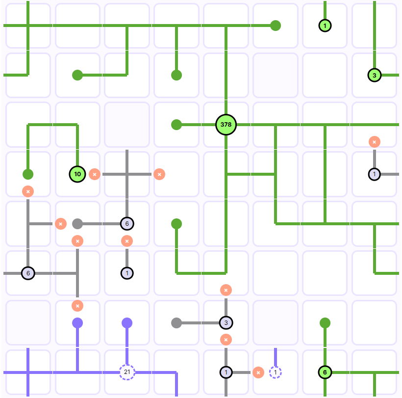
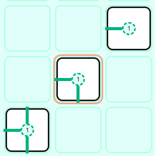
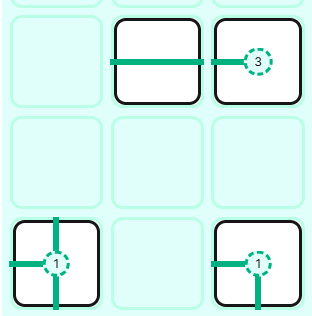
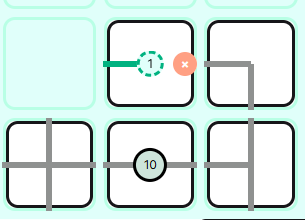
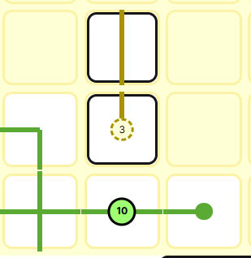

Gridlock is a game of spatial logic and strategic thinking. All players must play the same deck of tiles onto their boards - who will plan their moves to rack up the most points without pushing things too far?



# Making paths

Each round, you will be given a hand of tiles to place. You must place all of your tiles onto the board, following the rules of placement below. As tiles connect, they form paths, and the longer paths get, the more points they earn - _if_ you can complete them!

## Where you can place tiles

Tiles must be placed so that their path connects to either the edge of the board, or an "end" tile (a tile with only one direction).

When placing your first tiles, make sure at least one direction connects to the edge. "End" tiles, with only one direction, can be placed anywhere on the board. So can blank tiles.



Notice how the middle tile has a red ring around it - since it isn't connected to the edge by a path, and it's not an end piece, it cannot be placed there.

> You will not be able to submit your turn with invalid tile placements!

Once you've placed a valid tile, you can immediately begin building a path off of it in any direction. You can start as many paths as you want each turn.



### Unplaceable tiles {#unplaceable-tiles}

In some cases, you may have a tile in your hand which cannot be legally placed anywhere on your board. This tile will show up as faded in your hand, and you must submit your turn without placing it.

This usually happens late in the game.

## Connecting paths

To create a path, adjacent tiles must both have segments pointed toward one another.

## Breaking paths

If **any** tile connected to the path is adjacent to another tile without a matching segment, the **entire path** is _broken_.

**Broken paths earn no points!**



A broken path is grayed out and displays a red "x" symbol wherever the break(s) occurred.

You should avoid breaking long paths at all costs! This might mean choosing to break shorter ones if you've got unlucky tiles to place.

## Completing paths

To actually earn points from a path, it must be _completed_ before the end of the game. A completed path has terminated all ends either to the edge of the board, or to an end tile.



Once a path is completed, the points are locked in. This is the only way to earn points in the game: even if you don't break a path, if it remains incomplete by the end of the game, it doesn't score.

# Game end

The game is played until enough tiles have been drawn to fill an entire board. Whether or not you actually fill your board (for example, if you cannot legally place some of the tiles), the game will end.

# Scoring

Final scoring happens at the end of the game. All completed paths are scored, all other paths are ignored. Longer paths earn more and more points the longer they go: each consecutive tile in a path earns +1 point compared to the previous one. For example:

```
| Tile     | 1 |     2     |       3       |         4          |
-----------------------------------------------------------------
| Points   | 1 | 1 + 2 = 3 | 1 + 2 + 3 = 6 | 1 + 2 + 3 + 4 = 10 |
```

So it pays well to make long paths... _if_ you complete them. Don't get overconfident! Completing paths gets harder as the game goes on, space gets tight, and you start running out of chances to get the right tile.

# Terminology

## Tile

A square piece you must place somewhere on your board. Tiles usually have path segments drawn on them, which you connect to form longer paths to score points.

## End tile {#end-tile}

A tile with only one path direction. It has a dot in the center. Unlike other tiles which must connect to an edge, end tiles can be placed anywhere on the board.

## Path {#path}

A collection of adjacent tiles joined by touching segments. Paths can be either complete, incomplete, or broken. Only complete paths score points.

## Illegal placement {#illegal-placement}

With the exception of end tiles and blank tiles, all placed tiles must connect via a path to either an end tile, or the edge of the board. Tiles which are placed without following this rule will be highlighted with a red ring, and prevent submitting your turn.

## Blank tile {#blank-tile}

Occasionally you will come across tiles with no path segments at all. You still have to place these tiles! Placing a blank tile against another tile with an incoming path segment will break the path, so be careful.
